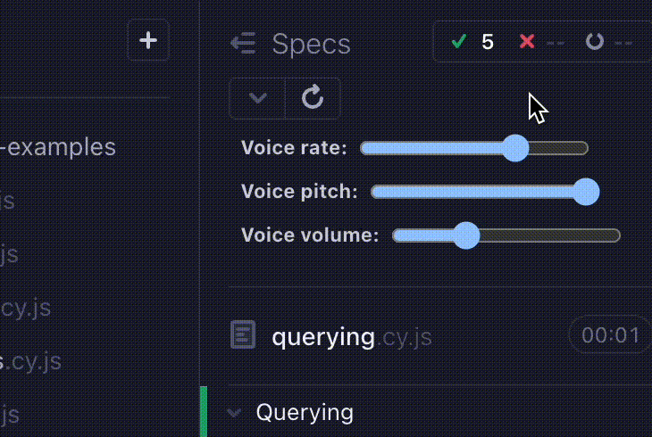

A close companion to other iterations of Text to speech (TTS), this assistive Cypress plugin offers an opt-in auditory tool to hear results of a spec file run to support local development and debugging.

> [!IMPORTANT]  
> This plugin is _currently_ only for running `cypress open` locally. See [TODO](#todo) for future plans.

Using `cypress open`, this Cypress plugin covers the following auditory feedback at the end of a spec file run:

- Whether a spec passed, passed with retries, failed or has all tests skipped
- The specific number of tests that passed, passed with retries, failed or were skipped
- The total spec run time
- Voice rate/pitch/volume adjustment sliders

## 🎬 Demo - Turn on the sound!

https://github.com/dennisbergevin/cypress-voice-plugin/assets/65262795/9810ed2e-dce5-4d0d-93a4-35d7cd18e5e8

## 🤝 Benefits

There are accessible benefits to auditory feedback, but two general audiences came to mind in developing this plugin:

1. For those who prefer an auditory style of feedback.
2. For those who are seeking a tool to help quickly analyze a spec run.

## 📦 Installation

Install this package:

```sh
npm install --save-dev cypress-voice-plugin
```

In `cypress/support/e2e.js` (For E2E tests) and/or `cypress/support/component.js` (For Component tests),

```js
import "cypress-voice-plugin";
```

## 🦺 Setup

Within `cypress open`, the voice plugin is enabled via a [Cypress environment variable](https://docs.cypress.io/guides/guides/environment-variables).

> [!NOTE]  
> You can only enable a single value for `voiceResultType` at a time. `voiceResultType` and/or `voiceTime` can be enabled together or independently.

| Environment variable | Value        | Can this variable alone enable plugin? | Purpose                                                                                                             | Sample Spoken Result                                          |
| -------------------- | ------------ | -------------------------------------- | ------------------------------------------------------------------------------------------------------------------- | ------------------------------------------------------------- |
| `voiceResultType`    | `"simple"`   | ✅ Yes                                 | High-level result of entire spec file run.                                                                          | "Spec passed."                                                |
| `voiceResultType`    | `"detailed"` | ✅ Yes                                 | In addition to what is provided by `"simple"`, the counts of tests passed, passed with retries, failed and skipped. | "Spec failed: 1 test passed, 2 tests failed, 1 test skipped." |
| `voiceTime`          | `true`       | ✅ Yes                                 | The time of entire spec file run.                                                                                   | "Total time: 34 seconds"                                      |

## 🏃‍♀️ Voice adjustments

To adjust the rate, pitch, and/or volume of spoken results within the browser when using this plugin, utilize the slider once inside a spec file:



## 🌏 Language support

Under the hood, the plugin utilizes in-browser text-to-speech capabilities via the [`speechSynthesis` Web Speech API](https://developer.mozilla.org/en-US/docs/Web/API/Web_Speech_API/Using_the_Web_Speech_API#speech_synthesis).

As the plugin does not set a language itself, [`speechSynthesis` is able to detect the language to use](https://developer.mozilla.org/en-US/docs/Web/API/SpeechSynthesisUtterance/lang):

> If unset, the app's (i.e. the <html> lang value) lang will be used, or the user-agent default if that is unset too.

## 📕 Example Environment Variable Setups

The following options are suggestions of how to set the environment variable(s). A more comprehensive [guide on environment variable setting](https://docs.cypress.io/guides/guides/environment-variables#Setting) can be found within official Cypress documentation.

### Setup using `cypress.env.json`

Add environment variable(s) to a created `cypress.env.json` file.

Example:

```js
{
  "voiceTime": true,
  "voiceResultType": "detailed",
}
```

This is a useful method for handling local use of this plugin, particularly if you add `cypress.env.json` to your `.gitignore` file. This way, enabling the plugin functionality via environment variable can be different for each developer machine rather than committed to the remote repository.

From official Cypress docs, more information on the [`cypress.env.json` method](https://docs.cypress.io/guides/guides/environment-variables#Option-2-cypressenvjson).

### Setup using `--env`

Alternatively, append the environment variable to the end of your `cypress open` cli command:

```shell
npx cypress open --env voiceResultType=simple
```

Or, combine multiple variables in one command to hear both result and total run time:

```shell
npx cypress open --env voiceResultType=detailed,voiceTime=true
```

From official Cypress docs, more information on the [`--env` method](https://docs.cypress.io/guides/guides/environment-variables#Option-4---env).

## TODO

- [ ] Look into additional ways to modify the voice and language for spoken content within the plugin
- [ ] Add functionality for `cypress run`

## Contributions

Feel free to open a pull request or drop any feature request or bug in the [issues](https://github.com/dennisbergevin/cypress-voice-plugin/issues).

Please see more details in the [contributing doc](./CONTRIBUTING.md).
